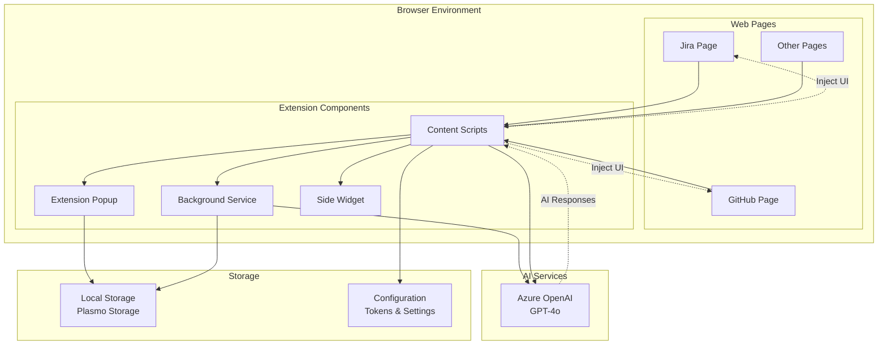
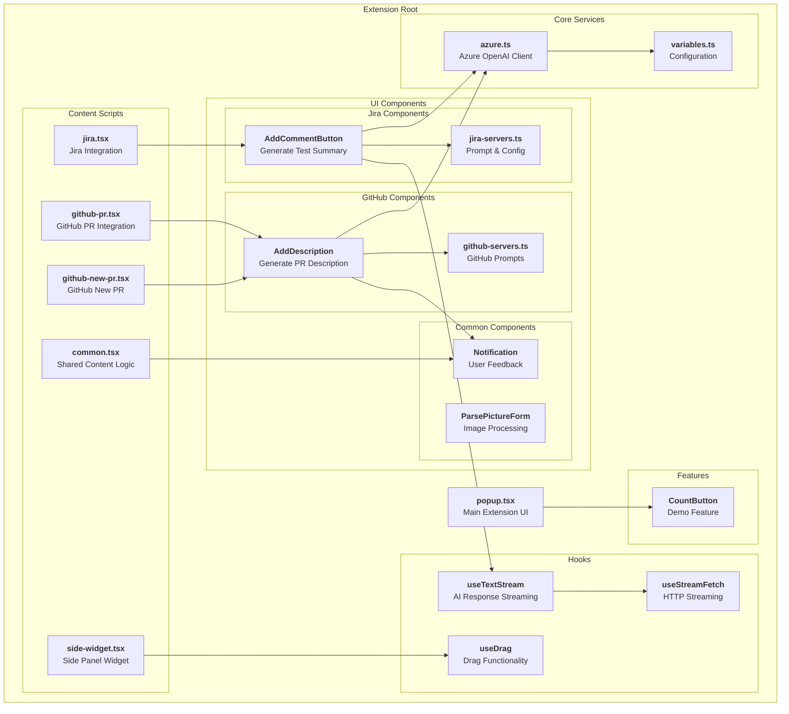
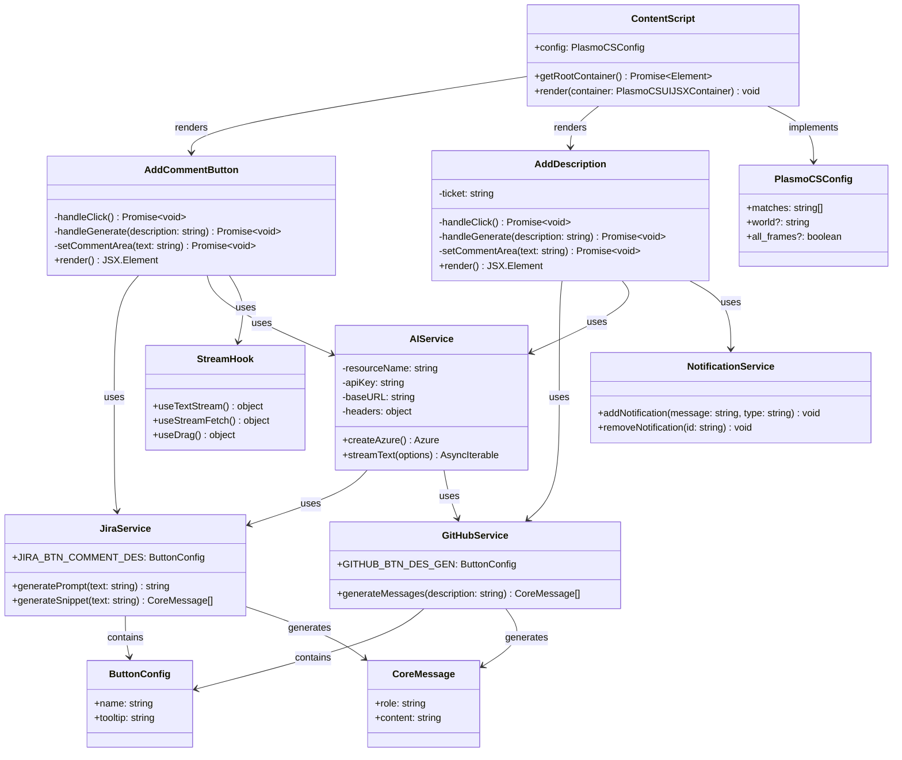
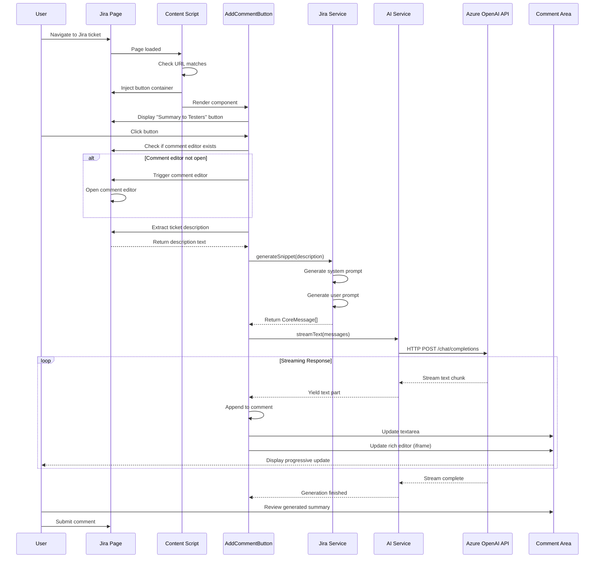
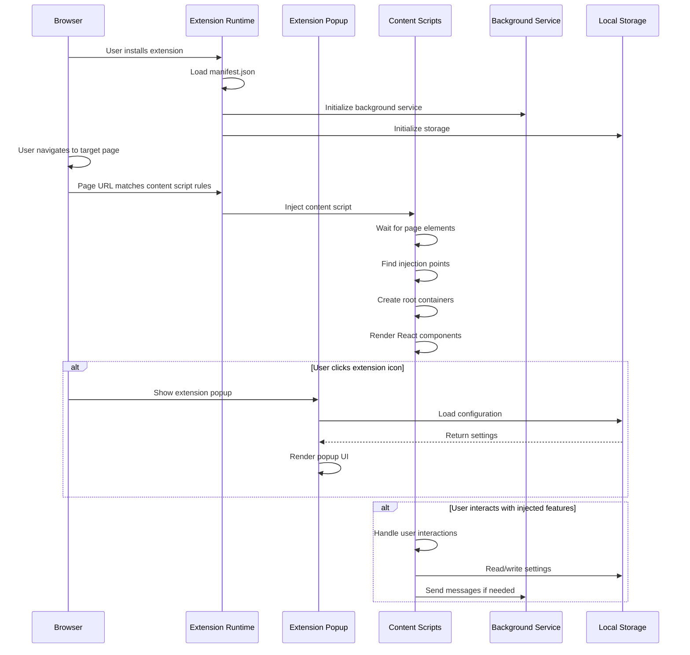
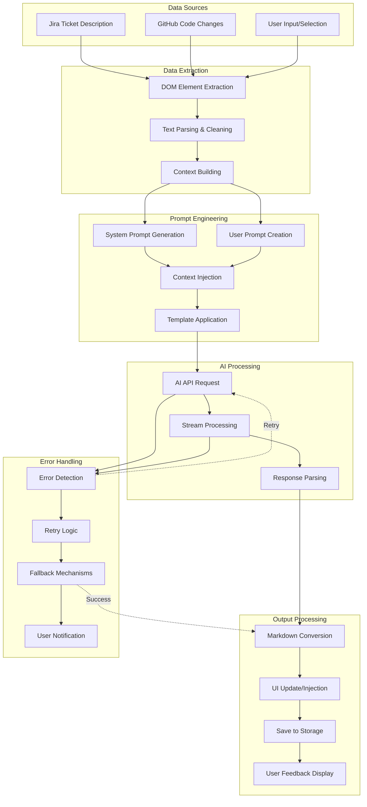
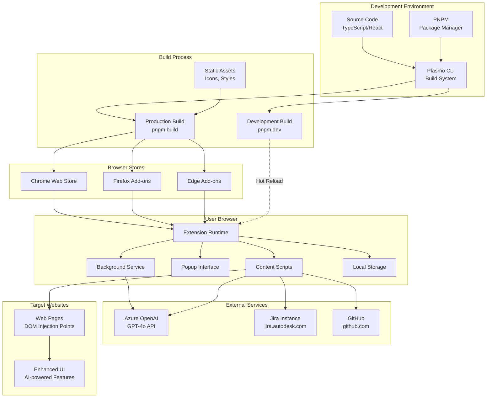
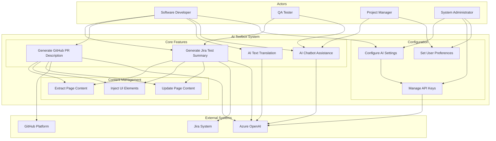

# AI Toolbox Browser Extension - Design Document

## Table of Contents
1. [Design Brief](#design-brief)
2. [System Architecture](#system-architecture)
3. [Component Design](#component-design)
4. [Class Design](#class-design)
5. [Sequence Diagrams](#sequence-diagrams)
6. [Data Flow Diagrams](#data-flow-diagrams)
7. [Deployment Architecture](#deployment-architecture)
8. [Use Case Diagrams](#use-case-diagrams)

---

## Design Brief

### Project Overview
**AI Toolbox** is a browser extension designed to automate repetitive development and documentation tasks by integrating AI capabilities directly into web-based workflows. Built using the Plasmo framework, it targets internal employees to enhance productivity and reduce manual work.

### Objectives
- **Automate repetitive tasks** in development workflows
- **Streamline communication** between developers and QA teams
- **Integrate AI-powered assistance** into daily browsing activities
- **Maintain consistency** in documentation and processes

### Scope
- **Current**: Jira integration for automated test summaries
- **Planned**: GitHub PR descriptions, AI translation, chatbot assistance
- **Target Platforms**: Chrome, Firefox, Edge (via Plasmo framework)

### Technology Stack
- **Framework**: Plasmo (Browser Extension Framework)
- **Frontend**: React 18.2.0 + TypeScript 5.3.3
- **Styling**: Tailwind CSS 3.4.1 + Mantine UI 7.11.1
- **AI Integration**: Azure OpenAI API (GPT-4o)
- **Build Tool**: PNPM + Plasmo CLI
- **State Management**: Plasmo Storage + React Hooks

---

## System Architecture

### High-Level Architecture

The AI Toolbox follows a modular browser extension architecture with content script injection and AI service integration.

### Architecture Principles
- **Content Script Injection**: Extension functionality is injected into target websites
- **Event-Driven Communication**: Components communicate via browser extension messaging
- **Streaming AI Integration**: Real-time AI response streaming for better UX
- **Modular Design**: Each feature is self-contained and reusable
- **Configuration-Based**: Behavior controlled through stored settings

---

## Component Design

### Component Hierarchy

The component structure follows a clear separation of concerns with content scripts, UI components, and shared services.

### Key Component Responsibilities

#### Content Scripts
- **jira.tsx**: Injects AI-powered comment generation into Jira pages
- **github-*.tsx**: Handles GitHub PR description automation
- **common.tsx**: Shared logic across different page types
- **side-widget.tsx**: Provides universal side panel functionality

#### UI Components
- **Feature-Specific**: Each platform (Jira, GitHub) has dedicated components
- **Reusable**: Common components shared across features
- **Configurable**: Server files contain prompts and configuration

#### Core Services
- **AI Service**: Manages Azure OpenAI integration
- **Custom Hooks**: Reusable React hooks for common functionality
- **Configuration**: Centralized settings and constants

---

## Class Design

### Core Classes and Interfaces

The class design follows TypeScript interfaces and React component patterns with clear separation of concerns.

### Class Descriptions

#### Core Services
- **AIService**: Manages Azure OpenAI client configuration and streaming
- **JiraService**: Handles Jira-specific prompt generation and configuration
- **GitHubService**: Manages GitHub PR description prompts and logic
- **NotificationService**: Provides user feedback and notification management

#### UI Components
- **AddCommentButton**: React component for Jira comment generation
- **AddDescription**: React component for GitHub PR description automation
- **ContentScript**: Base class for content script injection logic

#### Configuration & Data
- **PlasmoCSConfig**: Content script configuration interface
- **ButtonConfig**: UI button configuration structure
- **CoreMessage**: AI message format interface

#### Custom Hooks
- **StreamHook**: Collection of React hooks for streaming, drag, and fetch operations

---

## Sequence Diagrams

### Jira Comment Generation Flow

This sequence diagram shows the complete flow from user interaction to AI-generated comment in Jira.

### Extension Loading and Initialization Flow

This diagram shows how the browser extension loads and initializes its components.

---

## Data Flow Diagrams

### AI Processing Data Flow

This flowchart shows the complete data processing pipeline from user input to AI-generated output.

---

## Deployment Architecture

### Browser Extension Deployment Model

This diagram illustrates the complete deployment pipeline from development to end-user installation.

### Deployment Characteristics
- **Cross-Platform**: Single codebase deploys to multiple browsers
- **Hot Reload**: Development builds support real-time updates
- **Store Distribution**: Production builds distributed through official browser stores
- **Local Development**: Development builds can be loaded locally for testing
- **External Dependencies**: Requires network access to Azure OpenAI services

---

## Use Case Diagrams

### Primary Use Cases

This diagram shows the main use cases and actor interactions within the AI Toolbox system.

### Use Case Descriptions

#### Core Features
- **UC1 - Generate Jira Test Summary**: Automatically create structured test summaries for QA teams based on Jira ticket descriptions
- **UC2 - Generate GitHub PR Description**: Auto-generate comprehensive PR descriptions from code changes
- **UC3 - AI Text Translation**: Translate selected text content between languages
- **UC4 - AI Chatbot Assistance**: Provide contextual help and answer questions

#### Configuration & Management
- **UC5 - Configure AI Settings**: Set up AI model parameters and behavior
- **UC6 - Manage API Keys**: Handle authentication tokens and API access
- **UC7 - Set User Preferences**: Customize extension behavior and UI preferences

#### Content Management
- **UC8 - Extract Page Content**: Parse and extract relevant information from web pages
- **UC9 - Inject UI Elements**: Add extension UI components to target websites
- **UC10 - Update Page Content**: Modify page content with AI-generated text

---

## Technical Specifications

### Performance Requirements
- **Response Time**: AI generation should complete within 10-30 seconds
- **Streaming**: Real-time text streaming for better user experience
- **Memory Usage**: Minimal impact on browser performance
- **Network**: Efficient API usage with retry mechanisms

### Security Considerations
- **API Key Management**: Secure storage of authentication tokens
- **Content Security**: Validation of injected content
- **Permission Model**: Minimal required permissions for extension functionality
- **Data Privacy**: No persistent storage of user content

### Browser Compatibility
- **Chrome**: Primary target (Manifest V3)
- **Firefox**: Secondary support
- **Edge**: Chromium-based compatibility
- **Safari**: Future consideration

### Development Guidelines
- **Code Quality**: TypeScript strict mode, ESLint rules
- **Testing**: Component testing with React Testing Library
- **Documentation**: Inline documentation and README updates
- **Version Control**: Semantic versioning and changelog maintenance

---

## Conclusion

The AI Toolbox browser extension represents a comprehensive solution for integrating AI-powered productivity tools directly into developer workflows. The modular architecture allows for easy extension and maintenance while providing a consistent user experience across different platforms.

### Key Architectural Benefits
1. **Modularity**: Each feature is self-contained and independently maintainable
2. **Scalability**: Easy to add new platforms and AI capabilities
3. **User Experience**: Seamless integration with existing tools and workflows
4. **Performance**: Efficient content script injection and streaming responses
5. **Security**: Secure handling of API keys and user data

### Future Enhancements
- Additional platform integrations (Confluence, Slack, etc.)
- Enhanced AI model support and configuration options
- Advanced prompt engineering and customization
- Analytics and usage tracking for optimization
- Multi-language support for international teams

This design document serves as a comprehensive guide for developers, architects, and stakeholders to understand the system's structure, behavior, and extension points for future development. 