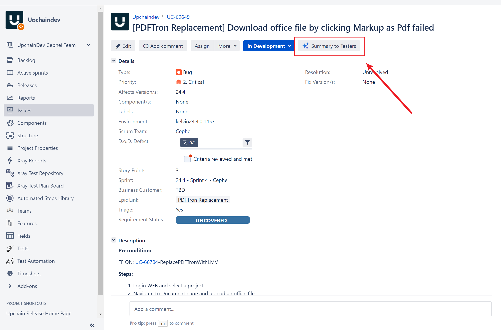
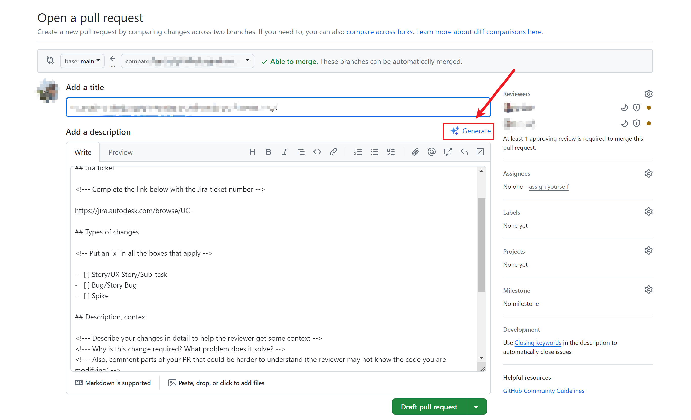

## Little Idea, Implement Fast, Touch AI Effortlessly 🤖✨

## Project Overview

### Why this project? 🤔
- This project is a browser extension designed to streamline repetitive tasks in development and documentation, enhancing efficiency and reducing redundancy. By automating mundane tasks, it aims to allow employees to focus on more critical and creative aspects of their work.
- Serving as a toolbox 🧰, it encompasses multiple practical tools that span various aspects of development and documentation, from code management to test tracking. Each tool is designed to be small but highly reusable.

### Why a browser extension? 🌐
- A browser extension is an efficient way to integrate directly into the user's daily browsing environment, providing immediate assistance and significantly boosting productivity. It seamlessly integrates with existing development and documentation workflows, offering instant support.

### What is this project about? 🛠️
- Designed exclusively for internal employees, this project targets repetitive tasks encountered during development or documentation writing. The goal is to improve work efficiency and reduce repetitive work, allowing employees to focus more on their core tasks.
- The extension will include various tools to improve non-code efficiency, such as:
    - Automatically generating descriptions for PRs in GitHub.
    - Summarizing comments for testers in Jira.
    - Additional features will be added based on user feedback and evolving needs.

### Key Features ✨
- Specific Page Features:
  - [x] **Jira Integration**: Automatically generate summaries and comments for testers, helping to streamline the communication process between developers and QA teams.
  
  - [ ] **GitHub Integration**: Automatically generate detailed PR descriptions based on the code changes, reducing the time developers spend on documentation and ensuring consistency.
  
  - [ ] **Sprint Review Wiki**: Automatically generate sprint review wiki pages based on Jira tickets, providing a comprehensive overview of the sprint's progress.
  - [ ] **?? Code Review Assistant ??**: Provide suggestions and best practices during code reviews, helping developers improve code quality and adhere to coding standards.
- Common Page Features:
  - [ ] **Selection-AI-Bot**: Implement a popup chatbot over selected text that can provide relevant information or suggestions based on the context, enhancing productivity.
  - [ ] **AI-Translate**: Automatically translate text from one language to another when a user highlights some context, facilitating cross-border communication and collaboration.
  - [ ] **AI-Bot**: Implement a chatbot on the right side of the web interface that can answer common questions and provide assistance to employees, reducing the need for manual intervention.
- [ ] **More little tools...**

### Benefits 🎉
- **Enhanced Efficiency**: By automating repetitive tasks, employees can dedicate more time to high-value activities.
- **Consistency and Accuracy**: Automated tools help maintain a consistent format and reduce human errors in documentation.
- **Improved Collaboration**: Streamlined communication between developers and testers leads to faster issue resolution and better project outcomes.

### Vision 🌟
- **Empower Employees**: Enable employees to leverage AI capabilities effortlessly, making their workflows more efficient and productive.
- **Continuous Improvement**: Regularly update the extension with new features and improvements based on user feedback and technological advancements.

### Conclusion 🚀
This browser extension is a step towards modernizing internal workflows by integrating AI-driven tools that reduce redundancy and enhance productivity. By focusing on automating repetitive tasks, it aims to create a more efficient and enjoyable work environment for employees.

---
## How to Develop

### Getting Started

First, run the development server:

```bash
pnpm dev
# or
npm run dev
```

Open your browser and load the appropriate development build. For example, if you are developing for the chrome browser,
using manifest v3, use: `build/chrome-mv3-dev`.

You can start editing the popup by modifying `popup.tsx`. It should auto-update as you make changes. To add an options
page, simply add a `options.tsx` file to the root of the project, with a react component default exported. Likewise to
add a content page, add a `content.ts` file to the root of the project, importing some module and do some logic, then
reload the extension on your browser.

For further guidance, [visit our Documentation](https://docs.plasmo.com/)

### Making production build

Run the following:

```bash
pnpm build
# or
npm run build
```

This should create a production bundle for your extension, ready to be zipped and published to the stores.

### Submit to the webstores

The easiest way to deploy your Plasmo extension is to use the built-in [bpp](https://bpp.browser.market) GitHub action.
Prior to using this action however, make sure to build your extension and upload the first version to the store to
establish the basic credentials. Then, simply
follow [this setup instruction](https://docs.plasmo.com/framework/workflows/submit) and you should be on your way for
automated submission!
